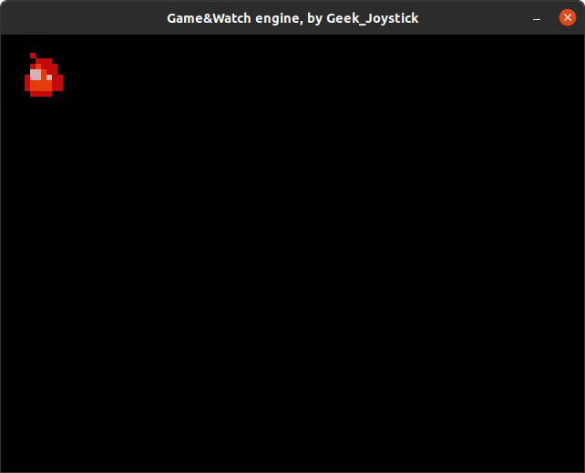
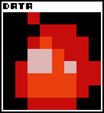
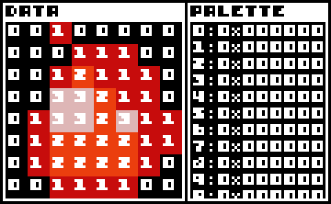
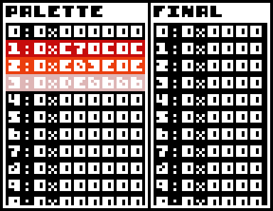
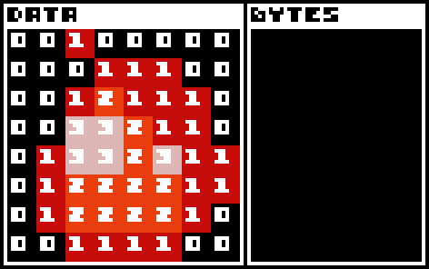
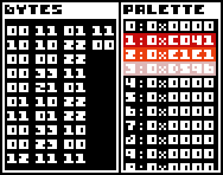
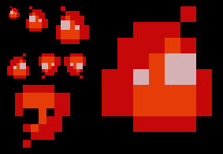

# Game&Watch Game Engine

So, basically, this is a game gone into a game engine project. \
It's a game engine for the Game and Watch.

This engine is intended to be relatively easy to get started with (There are relatively few dependencies, listed below).
There's a whole documentation just lower, and it should be fairly easy to understand.
Do know that this engine can run on the Game&Watch, but also your desktop!
Also as of now you can only compile your Game&Watch executable on a Linux-based distribution.
If not, no worries, you can send me a message on discord (my username is Geek_Joystick#4238), or go on the [Game&Watch modding discord server](https://discord.gg/hcJjQW8SVY)

## Dependencies
#### Desktop:
- [SDL2](https://www.libsdl.org/download-2.0.php)

#### Game&Watch:
- [gcc-arm-none-eabi](https://developer.arm.com/tools-and-software/open-source-software/developer-tools/gnu-toolchain/gnu-rm/downloads)

## Compilation

You can compile your program in four ways: \
- `make` or `make sdl` will compile your code to be ran on your desktop.\
- `make gnw-flash` will compile your code to be ran on your G&W via flashing.\
- `make gnw-ram` will compile your code to be ran on your G&W via it's RAM.

## Structure

Here's a basic  app made with the engine:

```C++
#include "GameAndWatchEngine.h"

//Basic entity setup
class Square : public Entity{
public:
	Square()
	: Entity(0, 0)
	{
		spriteID = 0;
		tag = "None";
	}
};

//Basic game class
class Game: public GameAndWatchEngine{
public:
	Game()
	: GameAndWatchEngine()
	{
		//Initialise the color palette for rendering
		uint16_t colors[16] = {0x0000, 0xD596, 0xE1E1, 0xC041, 
		0xFFFF, 0xFFFF, 0xFFFF, 0xFFFF,
		0xFFFF, 0xFFFF, 0xFFFF, 0xFFFF,
		0xFFFF, 0xFFFF, 0xFFFF, 0xFFFF};
		palette.SetColors(colors);
		renderer->SetPalette(&palette);

		//Create a sprite of a fire of size 8x8 at sprite slot 0 (256 slots total)
		spriteManager->CreateSprite(0, "\x00\x30\x00\x00\x00\x03\x33\x00\x00\x32\x33\x30\x00\x11\x23\x30\x03\x11\x21\x33\x03\x22\x22\x33\x03\x22\x22\x33\x00\x33\x33\x00", 4, 8);

		//Create a basic square at entity slot 0 (256 slots total) and setup its position to be (10;10)
		Entity* square = entityManager->CreateEntity<Square>(0);
		Transform* trans = square->GetTransform();
		trans->x = 10;
		trans->y = 10;
	}
};

//Initialising the Game class and starting it
int main(void)
{
	Game game;
	game.Start();
}
```

This code produces a black screen with a little fire sprite 10 pixels from the side and top of the screen:\


*Note: There will be features such as tilemaps, and layers (I think) down the line, and as such the structure of a program will change slightly overtime*

## Sprite structure

The sprites in this game engine have a specific structure, and must be hard-coded in order to be able to be put onto the actual console. This part will describe how the sprites are structured.

First off, the game engine uses a color palette for rendering, so sprites don't have a full color range, but you can easily change the color palette during the game's execution, and the sprite require less spaces. 
The palette can only contain 16 different colors that are in the RGB565 format. ([You can use this converter](http://drakker.org/convert_rgb565.html))

The palette can be defined like so:
```C++
uint16_t colors[16] = {
0x0000, 0xFFFF, 0xFFFF, 0xFFFF, 
0xFFFF, 0xFFFF, 0xFFFF, 0xFFFF,
0xFFFF, 0xFFFF, 0xFFFF, 0xFFFF,
0xFFFF, 0xFFFF, 0xFFFF, 0xFFFF};
palette.SetColors(colors);
renderer->SetPalette(&palette);
```
*Note: this is the default palette defined by the engine.*

Thanks to the palette size, we can encode two pixels into a single byte.
For instance `0x01` decodes to the colors `0` and `1` of the palette.

Knowing this we can start encoding sprites :smiley:.

For instance, we want to encode this sprite:\


We can take each pixel, and assign them a number based on their color.\


We can then create a palette out of all the pixels:\


And convert the palette from RGB888 to RGB565:\


And we can pair the numbers together to make bytes:\


Finally, we get this data:\


And thus we finally can enter this code to create the sprite within the engine:
```C++
//Code to set the palette (palette is shared by all sprites)
uint16_t colors[16] = {
0x0000, 0xC041, 0xE1E1, 0xD596, 
0x0000, 0x0000, 0x0000, 0x0000,
0x0000, 0x0000, 0x0000, 0x0000,
0x0000, 0x0000, 0x0000, 0x0000};
palette.SetColors(colors);
renderer->SetPalette(&palette);

//Code to create the sprite on slot 0
spriteManager->CreateSprite(0, "\x00\x30\x00\x00\x00\x03\x33\x00\x00\x32\x33\x30\x00\x11\x23\x30\x03\x11\x21\x33\x03\x22\x22\x33\x03\x22\x22\x33\x00\x33\x33\x00", 4, 8);
```

*Note: Do know that sprite width must be an even number. This is because in the engine, width is divided by two, as there are two pixels per byte*


## Sprite Rendering

Now that we covered how sprites are encoded, we will now cover how to render sprites to the screen. \
**Do know though, that the sprite drawing is handled by default by the game engine, BUT you can override the Draw function \
of your entities if you want more freedom with the way they're drawn.**
Currently there's only one drawing function in the renderer: `DrawSprite()`.

Here's an template call of this function:\
```C++
renderer->DrawSprite(sprite, x, y, scale, flipX, flipY, transparentColor);
```

Let's see what each parameter is for: \
- (Sprite*) spriteSlot: This is a pointer to the sprite you want to draw in the sprite manager\
- (int) x: This is the horizontal position of the sprite\
- (int) y: This is the vertical position of the sprite\
- (int) scale (default: 1): This is the scale (an integer scale)\
- (bool) flipX (default: false): If this flag is raised, the sprite will be flipped horizontaly.\
- (bool) flipY (default: false): Same as flipY, but vertical
- (char) transparentColor (default: 0): The color that is considered as transparent

By the way, in order to get the sprite pointer you must use the function `spriteManager->GetSprite(spriteSlot)`.

Here's an example of the same sprite drawn with different parameters: \

